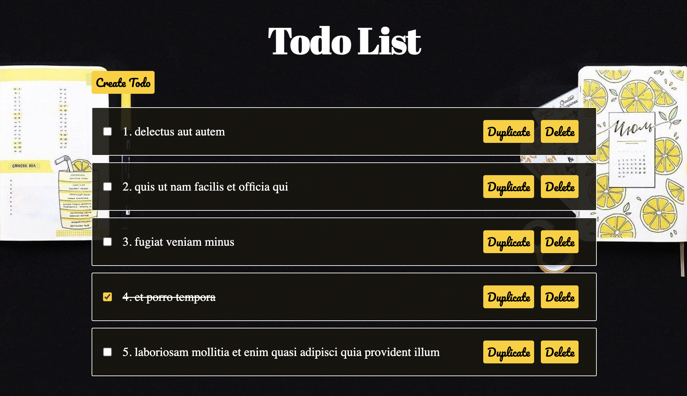
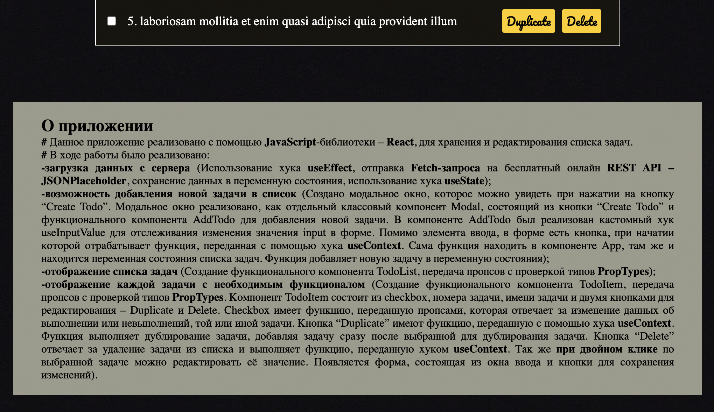

# React

#### Данное приложение реализовано с помощью JavaScript-библиотеки – React, для хранения и редактирования списка задач.

          
В ходе работы было реализовано:
       
<b> -загрузка данных с сервера</b> &#40;Использование хука
<b>useEffect</b>, отправка <b>Fetch-запроса</b> на бесплатный онлайн
<b>REST API</b> <b>– JSONPlaceholder</b>, сохранение данных в
переменную состояния, использование хука <b>useState</b>&#41;;
 
<b>-возможность добавления новой задачи в список</b> &#40;Создано
модальное окно, которое можно увидеть при нажатии на кнопку “Create
Todo”. Модальное окно реализовано, как отдельный классовый компонент
Modal, состоящий из кнопки “Create Todo” и функционального компонента
AddTodo для добавления новой задачи. В компоненте AddTodo был
реализован кастомный хук useInputValue для отслеживания изменения
значения input в форме. Помимо элемента ввода, в форме есть кнопка,
при начатии которой отрабатывает функция, переданная с помощью хука{" "}
<b>useContext</b>. Сама функция находить в компоненте App, там же и
находится переменная состояния списка задач. Функция добавляет новую
задачу в переменную состояния&#41;;
 
<b>-отображение списка задач</b> &#40;Создание функционального
компонента TodoList, передача пропсов с проверкой типов
<b>PropTypes</b>&#41;;
 
<b>-отображение каждой задачи с необходимым функционалом</b>
&#40;Создание функционального компонента TodoItem, передача пропсов с
проверкой типов <b>PropTypes</b>. Компонент TodoItem состоит из
checkbox, номера задачи, имени задачи и двумя кнопками для
редактирования – Duplicate и Delete. Checkbox имеет функцию,
переданную пропсами, которая отвечает за изменение данных об
выполнении или невыполнений, той или иной задачи. Кнопка “Duplicate”
имеют функцию, переданную с помощью хука <b>useContext</b>. Функция
выполняет дублирование задачи, добавляя задачу сразу после выбранной
для дублирования задачи. Кнопка “Delete” отвечает за удаление задачи
из списка и выполняет функцию, переданную хуком <b>useContext</b>. Так
же <b>при двойном клике</b> по выбранной задаче можно редактировать её
значение. Появляется форма, состоящая из окна ввода и кнопки для
сохранения изменений&#41;.

#### _screenshot(1)_

#### _screenshot(2)_

### `npm start`

Runs the app in the development mode.
Open [http://localhost:3000](http://localhost:3000) to view it in your browser.